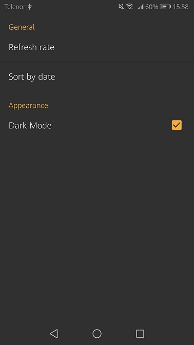
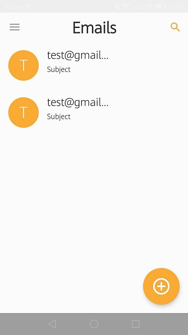
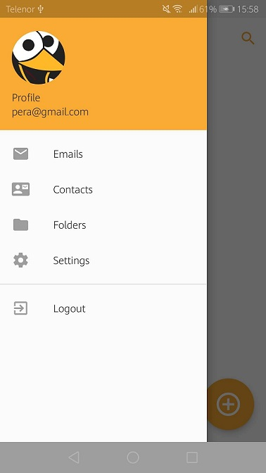
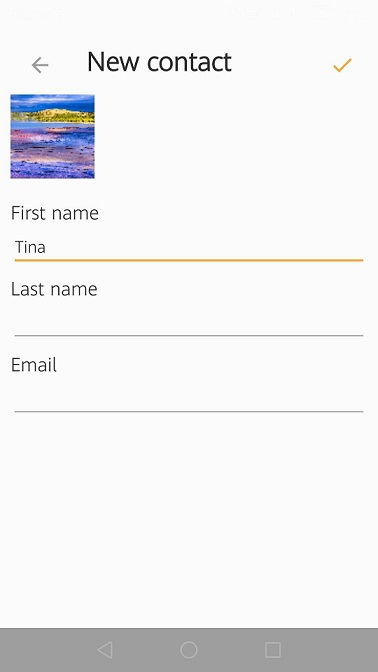

## Email App

An android app for managing users emails.

Data is being fetched from a SpringBoot application that is using JavaMail API for receiving and sending emails.

### Screenshots

|                              Settings                              |                            Main Page                             |                            Navigation                            |                             Add Contact                             |
| :----------------------------------------------------------------: | :--------------------------------------------------------------: | :--------------------------------------------------------------: | :-----------------------------------------------------------------: |
|  |  |  |  |
